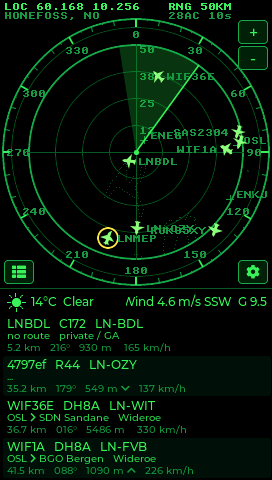
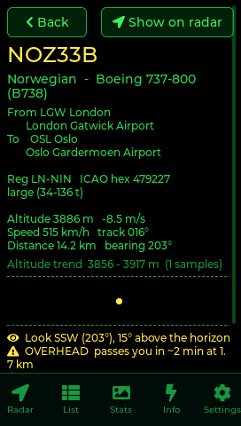
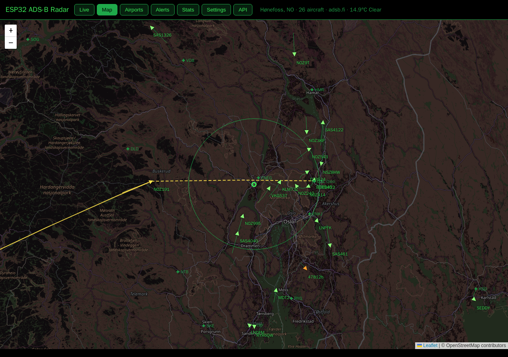
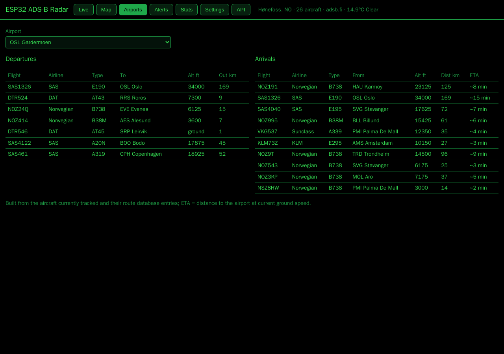

# ESP32 ADS-B Radar

A live aircraft radar for the **[JC4827W543](https://www.aliexpress.com/item/1005006729377800.html)** board (ESP32-S3, 4.3″ 480×272 touch display used in portrait).
It shows the aircraft around you on a green HUD-style radar fed by public ADS-B aggregators. No API keys,
no account: everything comes from free public data.

| Radar | Flight detail |
|---|---|
|  |  |

## Features

- **Radar view (top 60 %)** – four range rings, graduated bezel with degree marks, rotating sweep,
  aircraft drawn as heading-rotated silhouettes, trails, callsign labels (auto-decluttered), tap an
  aircraft to highlight it, `+`/`−` range buttons (10 – 400 km).
- **Closest four (bottom 40 %)** – callsign, type, registration; origin → destination with the destination
  city and the **airline** (route database from adsb.im, airline names embedded from OpenFlights); distance,
  bearing, altitude with climb/descent arrow, ground speed. First line: weather icon, **temperature and sky
  condition** on the left, **wind with gusts** on the right.
- **Overhead alert** – straight-line closest-point-of-approach for every aircraft; anything that will pass within
  the chosen radius (1–10 km) gets a pulsing ring, a flashing row, a banner on the radar and, optionally, full
  backlight until it has passed.
- **Flight detail page** – tap a row: airline, aircraft type spelled out, registration, weight category, origin and
  destination airports with names, altitude trend sparkline from the tracked trail, speed, track, closest approach,
  squawk code with its meaning.
- **Map underlay and airports** – coastline, lakes and borders within 520 km of Hønefoss drawn as faint dots behind
  the rings (Natural Earth 10m, embedded), plus labelled crosses for airports in southern Norway and neighbours.
- **Spotter line** – which way to look (compass and elevation above the horizon) and a flyover prediction
  ("passes you in ~3 min at 1.2 km") on the detail page, the radar banner and push notifications.
- **Watchlist and notable aircraft** – comma-separated registration / callsign / type prefixes; matches and notable
  heavies (A380, An-124, C-17, Beluga, 747-8 …) are drawn in gold and announced.
- **Aircraft classes** – airliner, light aircraft, helicopter, military, other: each its own tint, each can be hidden.
- **Push notifications** – [ntfy.sh](https://ntfy.sh) topic (no account) and/or a JSON webhook for emergency
  squawks, watchlist hits and flyovers. Alert history kept on the device.
- **Web panel** at `http://esp32-radar.local` – live table and screenshot, a **map** (OpenStreetMap tiles, every
  aircraft with heading, trails, and the selected flight's full origin-to-destination path), an **Airports** tab
  with departures and arrivals for any airport in the tracked routes (with ETAs), alert history, statistics,
  every setting editable from a phone (with a Wi-Fi scan list), Prometheus `/metrics`, and **OTA firmware
  updates** from the browser (armed from the device's Info page). Optional password.
- **MQTT / Home Assistant** – broker URI in settings; the radar appears in HA via MQTT discovery with
  nearest aircraft, distance, count, alerts, emergencies and highest aircraft as sensors.
- **Statistics page** – unique aircraft and new aircraft per hour today, records (highest, fastest, closest),
  top airlines and types, persisted across reboots; METAR for the nearest airport.
- **Route arc** – the selected flight's great-circle track from origin to destination across the map underlay.
- **Local receiver** – point it at your own dump1090 / readsb `aircraft.json`; internet sources are the fallback.
- **ISS** – drawn on the radar when its ground track crosses your range.
- **Location** – automatic from the device's public IP (ip-api.com, fallback ipwho.is), or override with
  **continent → country → city** pickers (country table embedded, city lists from countriesnow.space,
  coordinates from Open-Meteo geocoding), a typed city name, or raw latitude/longitude.
- **Wi-Fi entered on the device** with an on-screen keyboard (æ ø å included). Credentials saved by the
  DeskClock firmware are picked up automatically on first boot.
- **Update frequency** 2 – 60 s, units metric or aviation (nm / ft / kt), hide ground traffic, highlight
  military, emergency squawks (7500/7600/7700) in red, auto-range, sweep/trails/labels toggles,
  brightness slider with night dimming, data-source selection with automatic failover.
- **List page** – every tracked aircraft sorted by distance with squawk, track, speed; tap to jump to it
  on the radar. **Info page** – location, timezone, poll statistics, Wi-Fi, memory, uptime, reset.
- All HTTP work runs on core 0 in its own task; the UI on core 1 never blocks.

## Data sources

| Purpose | Service |
|---|---|
| Aircraft | [adsb.lol](https://api.adsb.lol) v2 and [adsb.fi](https://opendata.adsb.fi) v2, round-robin with cooldown on HTTP 429 |
| Routes (origin/destination) | adsb.im `routeset`, cached per callsign on the device |
| Airline names | embedded, generated from OpenFlights airlines.dat (`src/airlines.h`) |
| Map underlay | embedded, generated from Natural Earth 10m coastline/lakes/borders (`src/map_data.h`) |
| Aircraft types, airports | embedded tables (`src/actypes.h`, `src/airports.h`) |
| IP geolocation | ip-api.com (HTTP), fallback ipwho.is |
| Country list | embedded, generated from ISO-3166 (`src/countries.h`) |
| City list | countriesnow.space, top cities by population |
| City → coordinates | Open-Meteo geocoding (filtered by country code) |
| Timezone, temperature, wind | Open-Meteo forecast |
| METAR | aviationweather.gov (NOAA) |
| ISS position | wheretheiss.at |
| Push notifications | ntfy.sh (optional), any webhook (optional) |
| Time | NTP (pool.ntp.org) |

## Hardware

### Get the board

**[JC4827W543 on AliExpress](https://www.aliexpress.com/item/1005006729377800.html)** (Guition ESP32-S3 4.3″ display board). Choose the **capacitive-touch
version (JC4827W543C, GT911)** — the firmware drives the GT911; the resistive variant (JC4827W543R) will show the
screen but touch won't work. Any USB cable with data lines is enough to flash and power it.

| Component | Detail |
|---|---|
| Board | Guition JC4827W543**C** (capacitive) |
| SoC | ESP32-S3, 240 MHz dual core, Wi-Fi 2.4 GHz + BLE |
| Memory | 4 MB flash, 8 MB PSRAM (OPI) |
| Display | 4.3″ 480×272 NV3041A over QSPI, used rotated to 272×480 portrait |
| Touch | GT911 capacitive, I²C |
| USB | native USB-Serial/JTAG (flashing, serial console, power) |

## Flash from the browser

No IDE needed, Chrome or Edge: **https://frogswiper.cloud/esp32-adsb-radar/** — plug the board in over USB,
click Install, pick the port. Deployed from `web-installer/` to `/var/www/frogswiper.cloud/esp32-adsb-radar/`.

## Build and flash

Requires [PlatformIO](https://platformio.org/). The board shows up as a USB-JTAG/serial device
(`/dev/ttyACM0` on Linux).

```bash
cd firmware
pio run -t upload --upload-port /dev/ttyACM0
pio device monitor
```

The post-build script also writes `web-installer/firmware-merged.bin` for browser flashing with
esp-web-tools (`web-installer/index.html`).

### Serial debug commands (115200 baud)

| Key | Action |
|---|---|
| `S` | dump the screen as raw RGB565 (`scripts/screenshot.py` turns it into PNGs of every page) |
| `1`–`5` | switch to Radar / List / Stats / Info / Settings |
| `L` | re-locate by public IP |
| `T` | open the detail page for the nearest aircraft |
| `C<city>,<cc>` | set location by city, e.g. `CHønefoss,NO` |
| `D` | reset settings (keeps Wi-Fi) and reboot |
| `R` | reboot |

## Project structure

```
firmware/
├── platformio.ini
├── lv_conf.h                   # LVGL 8.3 config (dark theme, canvas, pixel fonts, snapshot)
├── scripts/merge_bin.py        # merged binary for the web installer
├── scripts/screenshot.py       # pull screenshots over serial
└── src/
    ├── main.cpp                # setup/loop, event dispatch, scheduling, serial commands
    ├── board_config.h          # pins and layout constants
    ├── display.cpp/h           # LovyanGFX + LVGL + GT911
    ├── settings.cpp/h          # NVS-backed settings
    ├── net_util.cpp/h          # PSRAM JSON allocator, HTTP(S) GET into PSRAM
    ├── net_task.cpp/h          # FreeRTOS network task, command queue, event bits
    ├── adsb.cpp/h              # aircraft model, fetch, merge, trails, stats
    ├── geo.cpp/h               # IP geolocation, city lists, geocoding, local weather
    ├── countries.h             # embedded continent/country/ISO-2 table
    ├── airlines.h              # embedded ICAO airline code → name table
    ├── actypes.h, airports.h   # aircraft type names, airport markers
    ├── map_data.h              # Natural Earth coastline/lakes/borders around Hønefoss
    ├── ntp.cpp/h               # NTP + POSIX timezone
    └── ui/
        ├── ui_main.cpp/h       # pages + nav bar (hidden on the radar page)
        ├── ui_radar.cpp/h      # HUD canvas, sweep, icons, closest-four panel
        ├── ui_list.cpp/h       # aircraft list
        ├── ui_detail.cpp/h     # flight detail page
        ├── ui_info.cpp/h       # status page
        └── ui_settings.cpp/h   # Wi-Fi, location pickers, radar options
```

## Licences

LovyanGFX, LVGL, ArduinoJson, TouchLib – MIT. Montserrat – SIL OFL. UNSCII – public domain.
Aircraft data courtesy of the adsb.lol and adsb.fi communities; please respect their rate limits.

## Web panel and HTTP API

Open `http://esp32-radar.local` (or the IP shown on the Info page). Tabs: Live, Map, Airports, Alerts, Stats, Settings, API.





| Endpoint | What it does |
|---|---|
| `GET /api/state` | live JSON: aircraft with routes, classes, trails; stats; weather; ISS; METAR |
| `GET /api/config`, `POST /api/config` | read / write any subset of the settings (JSON); saves and applies |
| `GET /api/alerts` | alert history |
| `GET /api/stats` | today's statistics |
| `GET /api/wifi/scan` | nearby networks |
| `GET /api/airports` | the embedded airport table |
| `GET /screen.bmp` | live screenshot |
| `GET /metrics` | Prometheus metrics |
| `POST /api/action` | `{"action":"locate"\|"reboot"\|"reset_stats"\|"page","page":n}` |
| `POST /ota` | `firmware.bin` upload; refused unless armed on the device (Info page, 10 minutes) |

Set a panel password in Settings to protect everything with HTTP Basic Auth (user `admin`).

Features in this release were inspired by [esp32flight](https://github.com/theqkash/esp32flight).
